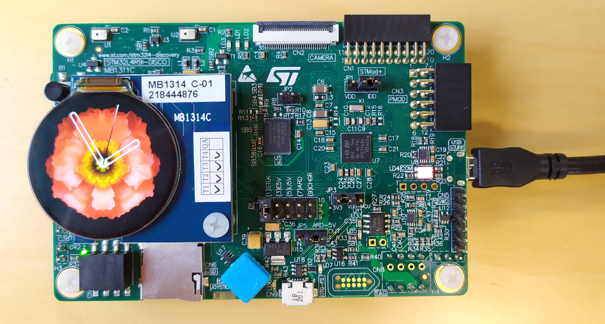
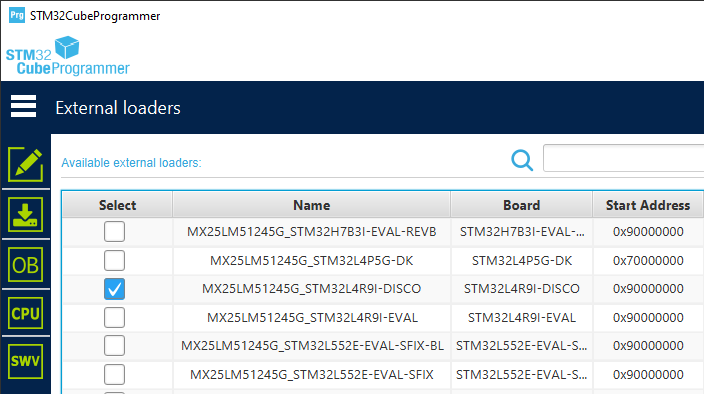
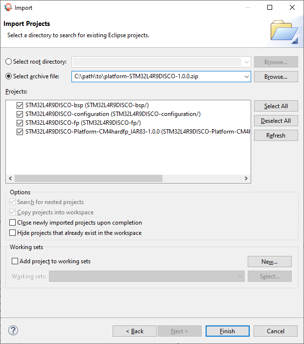
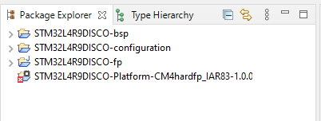
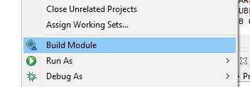
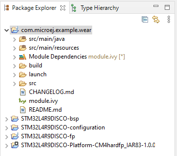
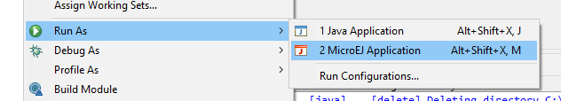
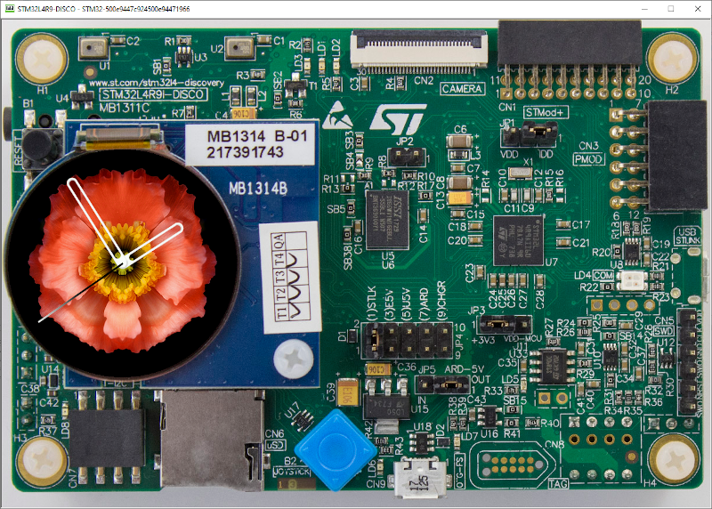
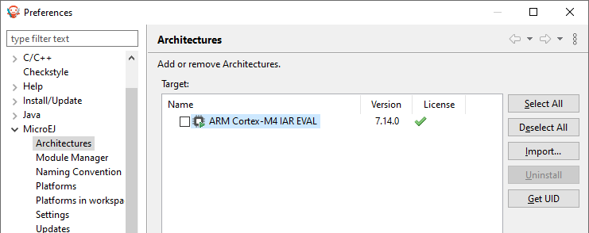
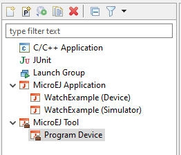

..
    Copyright 2022 MicroEJ Corp. Confidentiality and Intellectual Property. All rights reserved. 
	Information, technical data and tutorials contained in this document are confidential and proprietary under copyright Law of Industrial Smart Software Technology (MicroEJ S.A.) operating under the brand name MicroEJ®. Without written permission from MicroEJ S.A., copying or sending parts of the document or the entire document by any means to third parties is not permitted. Granted authorizations for using parts of the document or the entire document do not mean MicroEJ S.A. gives public full access rights.
	The information contained herein is not warranted to be error-free.
	MicroEJ® and all relative logos are trademarks or registered trademarks of MicroEJ S.A. in France and other Countries.
	Java™ is Sun Microsystems’ trademark for a technology for developing application software and deploying it in cross-platform, networked environments. When it is used in this site without adding the “™” symbol, it includes implementations of the technology by companies other than Sun. Java™, all Java-based marks and all related logos are trademarks or registered trademarks of Sun Microsystems Inc, in the United States and other Countries.
	Other trademarks are proprietary of their respective owners.

Get Started: Application Development on STMicroelectronics 32L4R9IDISCOVERY
===========================================================================

1. Contents of this package
---------------------------

This package contains two archives:

* ``platform-STM32L4R9DISCO-1.0.0.zip``: the MicroEJ Platform for the STM32L4R9IDISCOVERY.
* ``watch-sample-1.0.0.zip``: a sample watch application.
* this documentation, a step-by-step getting started.

2. Prerequisites
----------------

Hardware
~~~~~~~~

* A `32L4R9IDISCOVERY Discovery kit <https://www.st.com/en/evaluation-tools/32l4r9idiscovery.html>`_

Software
~~~~~~~~

* A PC with Windows 7 or later
* MicroEJ SDK Distribution 21.11 or higher (https://developer.microej.com/get-started/)
* A Java™ Runtime Environment 8 is needed on your host computer for running MICROEJ SDK. `Download Java™ Runtime Environments <https://java.com/en/>`_
* IAR Embedded Workbench 8.50.6
* STM32CubeProgrammer 2.10 or higher: `Download STM32CubeProgrammer <https://www.st.com/en/development-tools/stm32cubeprog.html>`_.
* ST-LINK USB drivers: `Download Drivers <http://www.st.com/en/development-tools/stsw-link009.html>`_.

3. Configuration
----------------

Hardware
~~~~~~~~

* All tests of this getting started have been done on the STMicroelectronics 32L4R9IDISCOVERY Discovery Kit.
* Connect the board to the PC using a USB 2.0 cable (Type-B Micro to Type-A) on connector ``CN13`` (not ``CN9``).
* Standard output traces can be read through a UART link (over USB) and a RS232 terminal. Configuration of the UART is: ``115200 bps, 8N1, no handshake``.

Software
~~~~~~~~

* Open STM32CubeProgrammer.
* Check that you can connect to the board, using ``Connect``.
* Go to page ``External Loaders``.
* In the list, check the item ``MX25LM51245G_STM32L4R9I-DISCO``.

4. Get Started With MicroEJ SDK
-------------------------------

* Start MICROEJ SDK.
* Select a workspace when prompted. If you are not familiar with Eclipse workspaces, select the default one and press OK.
* Select the location of the MicroEJ repository when prompted. the MicroEJ repository is a folder where Architectures, Platforms or Virtual Devices will be imported. If you are not familiar with MicroEJ repositories, select the default one and press OK.

.. note::

    For more information about MicroEJ SDK, please refer to the `SDK User Guide <https://docs.microej.com/en/latest/SDKUserGuide/workspace.html#workspaces-and-microej-repositories>`_.

5. Setup the platform
---------------------

Import the Platform Sources
~~~~~~~~~~~~~~~~~~~~~~~~~~~

* Click on ``File`` > ``Import...`` > ``General`` > ``Existing Projects into Workspace``.
* Click on ``Next``.
* Check the radio button ``Select archive file``.
* Click ``Browse``, and select the file ``platform-STM32L4R9DISCO-1.0.0.zip`` located in the same directory as this README file.
* New items appear in the list. Select all items and click on ``Finish``. 

The platform sources are now imported in the current workspace. There are four projects:

* ``STM32L4R9DISCO-configuration``:  the platform configuration project, it describes the platform features.
* ``STM32L4R9DISCO-bsp``: the Board Support Package (BSP) files.
* ``STM32L4R9DISCO-fp``: the "Front Panel" project, it is the simulator part of the platform. It describes how to represent the board (photo) and simulate it (touch panel, display, buttons, etc.).
* ``STM32L4R9DISCO-Platform-CM4hardfp_IAR83-1.0.0``: the project that contains the platform files after the platform build step. It is empty at first.
  

Build the Platform
~~~~~~~~~~~~~~~~~~

* Right-click on the project ``STM32L4R9DISCO-configuration``.
* Select ``Build Module``.

 
The platform build starts. You can see the build steps in the console. At the end of the build, the project ``STM32L4R9DISCO-Platform-CM4hardfp_IAR83-1.0.0`` is ready to use.

.. note::

    Please refer to the README.rst file of the platform for more details on its features.

6. Import the Sample Sources
----------------------------

* Click on ``File`` > ``Import...`` > ``General`` > ``Existing Projects into Workspace``.
* Click on ``Next``.
* Check the radio button ``Select archive file``.
* Click ``Browse``, and select the file ``watch-sample-1.0.0.zip`` located in the same directory as this README file.
* In the list of projects, select item ``com.microej.example.wear`` and click on ``Finish``. 

The sample project is now imported in the workspace.

7. Run the Demo on the Virtual Device
-------------------------------------

* Right-click on the project ``com.microej.example.wear``.
* Select ``Run as`` > ``MicroEJ Application``.
* In the dialog, select the Run Configuration ``WatchExample (Simulator)``.

The application is now running on the Virtual Device:

.. note::

    Please refer to the README.md file of the ``com.microej.example.wear`` project for more details about the sample application.

8. Activate your License
------------------------

Building the application for the target device requires MICROEJ SDK to be activated. Before going further, an active evaluation license is required.

Import the Architecture
~~~~~~~~~~~~~~~~~~~~~~~

* Right-click on the folder ``STM32L4R9DISCO-configuration\target~\dependencies``.
* Select ``Properties``.
* Copy the ``Location`` of the resource on the file system.
* Select ``File`` > ``Import`` > ``MicroEJ`` > ``Architectures`` and click on ``Next``.
* Check ``Select file``.
* Paste the copied location in the text field.
* Click ``Browse``.
* Select the file ``flopi4I35-eval.xpf``, and click ``Open``.
* Check the legal notice at the bottom of the dialog ("I agree and accept the above terms, ...").
* Select ``Finish``.

The architecture is now imported in the MicroEJ repository.

Get your UID
~~~~~~~~~~~~

* Select the ``Window`` > ``Preferences`` > ``MicroEJ`` > ``Architectures`` menu.
* Click on ``ARM Cortex-M4 IAR EVAL`` and press ``Get UID``.
* Copy the UID. It will be needed when requesting a license.

Generate Your Activation Key
~~~~~~~~~~~~~~~~~~~~~~~~~~~~

* Go to `<license.microej.com>`_.
* Click on ``Create a new account`` link.
* Create your account with a valid email address. You will receive a confirmation email a few minutes after. Click on the confirmation link in the email and login with your new account.
* Click on ``Activate a License``.
* Set Product P/N: to ``9PEVNLDBU6IJ``.
* Set UID: to the UID you generated before.
* Click on ``Activate``.
* The license is being activated. You should receive your activation key by email in less than 5 minutes. If not, please contact `<support@microej.com>`_.
* Once received by email, save the attached zip file that contains your activation key and move to the next section.

Activate MICROEJ SDK
~~~~~~~~~~~~~~~~~~~~

* Go back to MICROEJ SDK.
* Select the ``Window`` > ``Preferences`` > ``MicroEJ`` menu.
* Press ``Add...``.
* Browse the previously downloaded activation key archive file.
* Press ``OK``. A new license is successfully installed.
* Go to ``Architectures`` sub-menu and check that the architecture ``ARM Cortex-M4 IAR EVAL`` is now activated (green check).
* Your MICROEJ SDK is successfully activated. Proceed to the next step.

9. Run the Sample on the Device
-------------------------------

Define the IAR toolchain location
~~~~~~~~~~~~~~~~~~~~~~~~~~~~~~~~~

In order to compile and link the BSP inside MicroEJ SDK, you have to define the location of the IAR Workbench installation.

* Open the file ``STM32L4R9DISCO-bsp\projects\microej\EWARM\scripts\set_project_env.bat`` with a text editor.
* Set the variable ``IAREW_INSTALLATION_DIR`` to be the path to your IAR installation.
* Save the file.

Build the Sample Application
~~~~~~~~~~~~~~~~~~~~~~~~~~~~

* Right-click on the project ``com.microej.example.wear``.
* Select ``Run as`` > ``MicroEJ Application``.
* In the dialog, select the Run Configuration ``WatchExample (Device)``.

This first builds the Java application and then compiles/links the BSP files with IAR toolchain. When build is successful, it outputs the ``application.out`` file to program on the device.

Program the Device
~~~~~~~~~~~~~~~~~~

* Plug the 32L4R9IDISCOVERY device to the PC via USB.
* Ensure that STM32CubeProgrammer is closed and not connected to the device, it will prevent the program tool to connect properly.
* Go to ``Run`` > ``Run Configurations...``, under ``MicroEJ Tool``, select ``Program Device``.
* Click ``Run``.

The download begins.

The sample watch application should now be running on your STM32L4R9IDISCOVERY Discovery Kit.

.. note::

    Use the reset button or unplug/plug the USB cable if needed to force a reset if needed.

Troubleshooting
---------------

License check failed
~~~~~~~~~~~~~~~~~~~~

At step 9 ("Build the Sample Application"), if you experience the following error:

.. code:: 

    1 : SOAR ERROR
	[M65] - License check failed [Licenses file not found].

This means that the evaluation license is not properly activated.
Please run step 8 ("Activate your License") again.
You may also read our `documentation <https://docs.microej.com/en/latest/overview/licenses.html#evaluation-licenses>`_ for more details.

Program failed
~~~~~~~~~~~~~~

At step 9 ("Program the Device"), the program phase could fail with the following error:

.. code::

    ST-LINK error (DEV_CONNECT_ERR)

You might have ST-LINK Utility or STM32CubeProgrammer running and already connected to the device. Disconnect and try the program instructions again.

Black screen after program
~~~~~~~~~~~~~~~~~~~~~~~~~~

Force a hard reset by unplugging/plugging the USB power supply from the device.